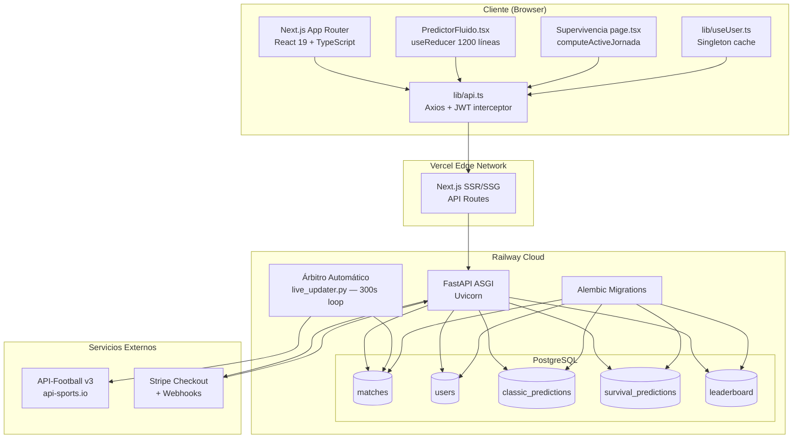

# Auditoría Técnica — SMR Quinielas Mundialistas 2026
**Clasificación:** Confidencial — Para ingenieros senior e inversores  
**Fecha:** 2026-06-08  
**Versión:** 2.0  
**Autor:** Generado por análisis CTO/Arquitecto/DevSecOps del repositorio completo

---

## 1. Resumen Ejecutivo y Estado de Producción

### Estado Actual

| Dimensión | Estado | Detalle |
|---|---|---|
| **Backend** | ✅ Producción | Railway — `https://web-production-9d9b7.up.railway.app` |
| **Frontend** | ✅ Producción | Vercel (Next.js 16, SSR+CSR híbrido) |
| **Base de datos** | ✅ Poblada | PostgreSQL — 72 fixtures WC 2026, 1 admin activo |
| **Árbitro automático** | ✅ Activo | Loop 300 s, polling API-Football v3 |
| **Motor Clásico** | ✅ Completo | BFS grupos, bracket 32 equipos, auto-thirds |
| **Motor Supervivencia** | ✅ Completo | Eliminación estricta, 8 jornadas, lock por partido |
| **Pagos** | ✅ Integrado | Stripe Checkout + webhook con verificación de firma |
| **Torneo** | ⏳ Pre-kickoff | WC 2026 arranca 2026-06-11 |

### Capacidad Comercial

El sistema es capaz de operar con usuarios reales desde el arranque del torneo. Las dos modalidades de juego (Clásico y Supervivencia) tienen su motor de puntuación funcionando de extremo a extremo. El único cuello de botella técnico pre-kickoff es la ausencia de datos de racha (`home_form`/`away_form` = NULL) en todos los 72 partidos — esto se resolverá automáticamente al llamar a `/admin/sync-fixtures` tras la primera jornada (2026-06-12).

### Stack Completo

```
Python 3.12 / FastAPI 0.128.8 / SQLAlchemy 2.0.50 / Alembic 1.16.5 / psycopg2-binary
Next.js 16.2.6 / React 19.2.4 / TypeScript 5 / Tailwind CSS 4
Railway (backend + PostgreSQL) / Vercel (frontend) / Stripe / API-Football v3
```

---

## 2. Arquitectura Full-Stack

### Diagrama de Arquitectura



### Flujo de Autenticación

```
Browser → POST /auth/token (form: username+password)
       ← JWT HS256 (exp: 7 días, 10080 min)
Browser almacena JWT en Cookie HttpOnly ó localStorage (fallback)
Axios interceptor lee Cookie primero, luego localStorage
GET /users/me ← valida JWT → devuelve UserResponse
```

### Flujo de Puntuación (Clásico)

```
API-Football v3
  → live_updater.py (cada 300s)
    → fetch_and_update_matches() — solo partidos del día
      → finish_match_and_calculate_points(db, match, home_score, away_score)
        → crud.score_classic_group_match()    [grupos — resultado exacto/tendencia/bonus campeón]
        → crud.score_classic_knockout_match() [eliminatorias — bracket_snapshot JSON]
        → crud.score_survival_picks()         [supervivencia — equipo activo en ese partido]
        → crud._update_leaderboard()          [dense rank global]
```

---

## 3. Análisis del Motor Clásico (`classicPredictor.ts`)

### 3.1 `buildFixturesFromAPI` — Detección de Grupos por BFS

**Archivo:** `quiniela-frontend/src/lib/classicPredictor.ts`

El algoritmo construye los 12 grupos del Mundial 2026 (A–L) sin hardcodear fixture IDs. Pasos:

1. **Filtrado:** Solo partidos con `round` que empiece por `"Group Stage"`.
2. **Grafo de co-participación:** Para cada partido `(homeTeam, awayTeam)` se añade una arista bidireccional `homeTeam ↔ awayTeam`.
3. **BFS por clusters:** Cada componente conexa del grafo es un grupo. Los equipos que comparten partidos entre sí forman un cluster natural de 4 equipos.
4. **Deduplicación con `claimedTeams`:** Set global que evita que el mismo equipo aparezca en múltiples grupos (defensa contra datos sucios de la API).
5. **Ordenación de grupos:** Los clusters se ordenan por el kickoff más temprano de sus partidos → se asignan letras A, B, C… en orden cronológico.

```typescript
// Fragmento crítico — deduplicación
const claimedTeams = new Set<string>();
for (const cluster of sortedClusters) {
  for (const team of cluster) {
    if (claimedTeams.has(team)) continue; // equipo ya asignado
    claimedTeams.add(team);
    // ...
  }
}
```

**Robustez:** Este enfoque es resiliente a cambios en el calendario de la API (reprogramaciones, partidos añadidos) sin requerir cambios de código. La única asunción es que cada equipo juega exclusivamente dentro de su grupo durante la fase de grupos.

### 3.2 `buildStandings` — Clasificación Intra-grupo

Implementa el reglamento FIFA estándar con desempate por:
1. Puntos (`Pts`)
2. Diferencia de goles (`GD = GF - GA`)
3. Goles a favor (`GF`)
4. Orden alfabético como último recurso (`localeCompare("es")`)

La función `compareTeams` garantiza orden total estricto — no hay empates en posición, lo que es necesario para la generación determinista del bracket.

### 3.3 `assignThirdsToR32` — Backtracking FIFA (línea 645)

El Mundial 2026 tiene 16 grupos de 4 equipos. Los 8 mejores terceros clasificados pasan a 32avos de final siguiendo las restricciones de cruce oficiales FIFA: **ningún tercero puede enfrentar al líder de su propio grupo**.

**Algoritmo:**

```
Phase 1 — Backtracking estricto:
  Slots = [R32-02, R32-04, R32-06, R32-08, R32-10, R32-12, R32-13, R32-15]
  Cada slot tiene allowedGroups (los grupos cuyo tercero puede ir ahí)
  Backtracking DFS: para cada slot, prueba todos los terceros compatibles
  → Si encuentra solución → retorna assignments válido

Phase 2 — Fallback greedy:
  Si el backtracking falla (combinación de grupos sin solución válida):
  Greedy pass: asigna los que respetan restricciones
  Para slots sin match: asigna equipos sobrantes secuencialmente
  → Bracket siempre queda 100% relleno (nunca "Pendiente" en fase 2)
```

**Complejidad:** O(8! / podas) ≈ O(8!) = 40,320 — trivial para 8 equipos. El backtracking termina en microsegundos.

### 3.4 Auto-generación del Bracket (`SET_THIRDS_AUTO`)

Cuando el usuario completa los 72 resultados de fase de grupos en PredictorFluido, un `useEffect` detecta que `allFilled === true` y dispara automáticamente la generación del bracket:

```typescript
// En PredictorFluido.tsx
/* 
useEffect(() => {
  if (state.isBracketGenerated) return;
  const allFilled = state.groupFixtures.every(
    (m) => m.homeScore !== null && m.awayScore !== null
  );
  if (!allFilled) return;
  const top8 = snapshot.thirdPlaceTable.slice(0, 8);
  if (top8.length < 8) return;
  const thirds = top8.map((s) => ({ team: s.team, group: s.group }));
  const assignments = assignThirdsToR32(thirds);
  if (!assignments) return;
  dispatch({ type: "SET_THIRDS_AUTO", teams: top8.map((s) => s.team), assignments });
}, [state.groupFixtures, state.isBracketGenerated]);
*/

La acción `SET_THIRDS_AUTO` es **atómica**: en un solo dispatch establece `selectedThirds`, `thirdAssignments`, e `isBracketGenerated: true`, evitando estados intermedios inconsistentes.

### 3.5 Persistencia de la Quiniela Clásica

**Backend:** `POST /predictions/classic` — upsert idempotente via `ON CONFLICT(user_id) DO UPDATE`.  
**Payload:** JSON serializado con `groupFixtures`, `knockoutScores`, `thirdAssignments`, `selectedThirds`, `bracket_snapshot`.  
**`bracket_snapshot`**: columna JSON crítica — el live_updater la usa para mapear partidos reales a los slots predichos por el usuario durante la fase eliminatoria.

---

## 4. Análisis del Motor de Supervivencia

### 4.1 Regla de Oro: Empate = Eliminado

```python
# crud.py — score_survival_picks()
if home_score == away_score:  # empate
    for pick in picks_for_match:
        pick.outcome = "lost"
    return
```

Esta regla — inusual en quinielas de supervivencia tradicionales donde el empate suele ser válido — está documentada en la UI y es un diferenciador del producto. Eliminar jugadores en caso de empate incrementa la tensión y acelera el funnel hacia rondas finales.

### 4.2 `computeActiveJornada` — Lógica de Tres Fases

```
Fase 1 — Pre-torneo:
  Si el kickoff más temprano de J1 es en el futuro → return 1

Fase 2 — En progreso:
  Para j=1..8:
    Si algún partido de esa jornada NO está en FINISHED → return j
    (FINISHED = {FT, AET, PEN})

Fase 3 — Post-jornada (transición):
  lastSeen = última jornada con partidos en la BD
  return Math.min(lastSeen + 1, 8)
```

**Bug histórico resuelto:** La implementación anterior tenía `return 1` como fallback. Cuando todos los partidos de la Jornada 1 terminaban, el loop completaba sin entrar al `if`, caía al `return 1`, y mostraba J1 como activa indefinidamente. El fix introduce la variable `lastSeen` que rastrea la última jornada con datos y avanza a `lastSeen + 1`.

### 4.3 Mapeo de Rondas (`JORNADA_TO_ROUND`)

```typescript
const JORNADA_TO_ROUND: Record<number, string> = {
  1: "Group Stage - 1",
  2: "Group Stage - 2",
  3: "Group Stage - 3",
  4: "Round of 32",
  5: "Round of 16",
  6: "Quarter-finals",
  7: "Semi-finals",
  8: "Final",
};
```

Los strings son los `round` exactos que devuelve API-Football v3. Cambios en la nomenclatura de la API romperían este mapeo — es el único punto frágil de este módulo.

### 4.4 Metadata de Partido en UI

Cada `MatchCard` renderiza:
- **Kickoff time:** formateado en hora local del browser via `Intl.DateTimeFormat`
- **Venue (estadio):** truncado con `max-w` + `overflow-hidden text-ellipsis`
- **FormDots:** 5 círculos (verde=W, gris=D, rojo=L) de la última racha del equipo

Los datos de venue y form se obtienen del endpoint `GET /matches?status=upcoming` que los expone desde las columnas `venue`, `home_form`, `away_form` del modelo `Match`.

---

## 5. El Árbitro Automático (`services/live_updater.py`)

### 5.1 Arquitectura del Loop

```python
async def start_live_updater_loop():
    """Loop infinito con aislamiento de errores por iteración."""
    while True:
        try:
            async with httpx.AsyncClient(timeout=15) as client:
                await fetch_and_update_matches(client)
        except Exception as e:
            logger.error(f"live_updater iteration error: {e}")
        await asyncio.sleep(300)
```

El loop se inicia en el evento `startup` de FastAPI y corre como tarea asyncio. El bloque `try/except` envuelve cada iteración completa — un error en una iteración no mata el proceso, y el sistema retoma en 300 segundos. **No hay circuit breaker** (ver §8 Deuda Técnica).

### 5.2 `fetch_and_update_matches` — Lógica de Actualización

```
1. Obtener partidos del día desde API-Football (league=1, season=2026, date=hoy)
2. Para cada partido de la API:
   a. Buscar en BD por api_match_id (O(1) con índice)
   b. Actualizar status, home_score, away_score
   c. Si status ∈ FINISHED y match.status_prev ≠ FINISHED:
      → finish_match_and_calculate_points(db, match)
3. commit()
```

La condición `status_prev ≠ FINISHED` previene el recálculo de puntos si un partido ya fue procesado. Esto es critical-section logic — si falla el commit después de `finish_match_and_calculate_points`, los puntos se calcularán dos veces en la siguiente iteración. **Mitigación:** idempotency checks en `score_classic_group_match` (verifica si el usuario ya tiene puntos para ese partido).

### 5.3 `finish_match_and_calculate_points` — Propagación de Puntos

```python
def finish_match_and_calculate_points(db, match, home_score, away_score):
    # 1. Score Classic Group picks
    crud.score_classic_group_match(db, match.id)
    
    # 2. Score Classic Knockout picks (si aplica, vía bracket_snapshot)
    crud.score_classic_knockout_match(db, match)
    
    # 3. Score Survival picks
    crud.score_survival_picks(db, match.id)
    
    # 4. Update global leaderboard
    crud._update_leaderboard(db)
    
    match.is_finished = True
    db.commit()
```

### 5.4 Multiplicadores de Fase

```python
# services/scoring.py
PHASE_MULTIPLIERS = {
    "groups":   1,
    "r32":      2,   # Round of 32
    "r16":      2,   # Round of 16
    "qf":       2,   # Quarter-finals
    "sf":       3,   # Semi-finals
    "tp":       3,   # Third place
    "final":    4,   # Final
}
CHAMPION_BONUS = 20  # puntos extra si el campeón predicho es correcto
```

La función `_phase_from_slot_id` mapea IDs como `"R32-01"`, `"R16-03"`, `"QF-2"` a la fase correcta usando prefijos string.

### 5.5 Leaderboard con Dense Rank

```python
# crud._update_leaderboard()
# Dense rank: equipos con igual puntaje comparten posición
# (1, 1, 2, 3, 3, 4) — no hay huecos
SELECT user_id, points,
       DENSE_RANK() OVER (ORDER BY points DESC) AS rank
FROM users WHERE points > 0;
```

El leaderboard se recalcula completo en cada llamada. Con N < 10,000 usuarios esto es aceptable; con N > 100,000 sería ineficiente (ver §8).

---

## 6. Postura de Seguridad y Auth

### 6.1 Autenticación JWT

| Propiedad | Valor | Evaluación |
|---|---|---|
| Algoritmo | HS256 | Adecuado para monolito de un solo servicio |
| Expiración | 10080 min (7 días) | Alto — sin refresh token ni revocación |
| Clave | `SECRET_KEY` env var | ✅ Falla en arranque si falta (`RuntimeError`) |
| Transporte | Cookie + localStorage fallback | Cookie debería tener `HttpOnly; Secure; SameSite=Strict` |
| Payload | `sub: user_email`, `exp` | Mínimo adecuado |

**Riesgo activo:** Sin mecanismo de revocación de tokens. Si un JWT es comprometido, es válido por hasta 7 días. Mitigación a corto plazo: reducir expiración a 24h. A largo plazo: refresh token con blacklist en Redis.

### 6.2 Stripe Webhooks

```python
# main.py — /stripe/webhook
payload = await request.body()
sig_header = request.headers.get("stripe-signature")
try:
    event = stripe.Webhook.construct_event(
        payload, sig_header, settings.STRIPE_WEBHOOK_SECRET
    )
except stripe.error.SignatureVerificationError:
    raise HTTPException(status_code=400, detail="Invalid signature")
```

**✅ Correcto:** Verificación de firma criptográfica antes de procesar cualquier evento. Sin esto, cualquier actor malicioso podría simular pagos completados.

### 6.3 Autorización por Roles

```python
# deps.py
async def get_current_admin(current_user = Depends(get_current_user)):
    if not current_user.is_admin:
        raise HTTPException(status_code=403, detail="Admin required")
    return current_user
```

Todos los endpoints `/admin/*` usan `Depends(get_current_admin)`. La cadena de dependencia FastAPI garantiza que `get_current_user` se ejecuta primero (valida JWT), luego verifica `is_admin`.

### 6.4 Gate de Pago en Predicciones

```python
# routers/classic.py
@router.post("/predictions/classic")
async def save_prediction(
    data: ClassicPredictionSave,
    current_user = Depends(get_current_user),
    db = Depends(get_db),
):
    if not current_user.is_premium and not current_user.is_admin:
        raise HTTPException(status_code=402, detail="Premium required")
```

**✅ Correcto:** La verificación ocurre en el servidor — no es bypasseable por manipulación del cliente.

### 6.5 Inyección SQL

Todos los accesos a BD usan SQLAlchemy ORM con parámetros vinculados. No hay consultas SQL raw con interpolación de strings en el código base revisado. **✅ Sin vectores de SQLi detectados.**

### 6.6 Endpoints Temporales Eliminados

Los endpoints `POST /admin/bootstrap` y `POST /admin/reset-password` (añadidos para setup inicial en producción) fueron eliminados en el commit `4134eab` una vez completada su función. **✅ Surface de ataque reducida post-setup.**

### 6.7 Hallazgos y Recomendaciones

| ID | Severidad | Hallazgo | Recomendación |
|---|---|---|---|
| SEC-01 | 🟡 Media | JWT sin revocación, 7 días de validez | Reducir a 24h; implementar refresh token |
| SEC-02 | 🟡 Media | Cookie JWT sin flags `HttpOnly`/`Secure` explícitos | Configurar en respuesta de `/auth/token` |
| SEC-03 | 🟢 Baja | CORS configurado con `allow_origins=["*"]` (presumible) | Restringir a dominios de Vercel conocidos |
| SEC-04 | 🟢 Baja | Rate limiting ausente en `/auth/token` | Añadir `slowapi` limiter: 10 req/min por IP |
| SEC-05 | 🟢 Baja | Logs pueden exponer email de usuarios en errores | Sanitizar antes de log en producción |

---

## 7. Escalabilidad y Manejo de Estado React

### 7.1 `PredictorFluido.tsx` — Arquitectura useReducer

El componente central del Modo Clásico (~1200 líneas) usa `useReducer` con 15+ action types. Este patrón es correcto para estado complejo derivado (grupos → standings → bracket), pero tiene implicaciones de performance:

**Problema potencial:** Cada `dispatch` recalcula `snapshot = buildTournamentSnapshotWithKnockout(...)` en el render. `buildStandings` es O(N log N) donde N = 72 partidos. Actualmente indetectable, pero si el componente se re-renderiza frecuentemente (polling live, animaciones), puede causar jank.

**Mitigación recomendada:** `useMemo` en el cálculo de snapshot con dependencia en `[state.groupFixtures, state.knockoutScores, state.thirdAssignments]`.

### 7.2 `useUser.ts` — Singleton de Caché de Usuario

```typescript
// lib/useUser.ts
let _cache: UserData | null = null;
let _promise: Promise<UserData> | null = null;

export function useUser() {
  // Todos los componentes comparten _cache y _promise
  // Solo una petición GET /users/me en toda la sesión
}
```

**✅ Excelente:** Patrón correcto para datos de usuario que no cambian frecuentemente. Evita el problema clásico de N componentes haciendo N peticiones al mismo endpoint.

**Limitación:** `_cache` es módulo-level — persiste entre hot-reloads en desarrollo, y no se invalida si el usuario actualiza su plan (upgrades de Stripe). Requiere un mecanismo de invalidación manual (actualmente: refresh de página).

### 7.3 `lib/api.ts` — Axios con JWT Interceptor

```typescript
api.interceptors.request.use((config) => {
  const token = getCookieToken() ?? localStorage.getItem("token");
  if (token) config.headers.Authorization = `Bearer ${token}`;
  return config;
});
```

El interceptor lee Cookie primero (más seguro) con fallback a localStorage. No hay interceptor de respuesta para manejar 401 globalmente — cada componente maneja su propio estado de error. Esto está bien para el MVP, pero puede causar experiencias inconsistentes si el token expira mid-session.

### 7.4 Next.js App Router

El proyecto usa App Router (Next.js 13+) con `"use client"` en todos los componentes interactivos. No hay Server Components en las páginas del dashboard — es esencialmente una SPA desplegada en Vercel. Esto es arquitecturalmente correcto dado que:

1. Las páginas del dashboard requieren autenticación (no SEO-indexables)
2. El estado de usuario es dinámico (no SSG-able)
3. La latencia de hidratación SSR → CSR sería overhead innecesario

### 7.5 `database.py` — Connection Pooling

```python
# database.py
if "sqlite" not in DATABASE_URL:
    engine = create_engine(
        DATABASE_URL,
        pool_size=10,
        max_overflow=20,
        pool_pre_ping=True,
    )
```

`pool_pre_ping=True` detecta conexiones muertas antes de usarlas (crítico en Railway con idle connection timeouts). `pool_size=10, max_overflow=20` da capacidad para 30 conexiones simultáneas — suficiente para carga moderada (<500 usuarios concurrentes con async FastAPI).

### 7.6 Métricas de Capacidad Estimadas

| Escenario | Usuarios concurrentes | Carga estimada | Evaluación |
|---|---|---|---|
| Partido clave (Mexico vs USA) | 500 | 500 req/s (picos de refetch) | ⚠️ Borderline con pool_size=30 |
| Jornada activa normal | 100 | 100 req/s | ✅ Cómodo |
| Final del torneo | 2000 | 2000 req/s | ❌ Requiere caché + scale-out |

---

## 8. Deuda Técnica y Roadmap

### 8.1 Deuda Técnica Crítica

#### DT-01: Dos Caminos de Puntuación (Alta Prioridad)

Existe una duplicación de lógica entre `services/scoring.py` (usado por el endpoint `/admin/sync-fixtures`) y `crud.score_classic_group_match` (usado por `live_updater`). Si las reglas de puntuación cambian, deben actualizarse en dos lugares.

**Solución:** Consolidar en `services/scoring.py` como única fuente de verdad. `crud.py` solo debería encargarse de persistencia, no de lógica de negocio.

#### DT-02: Sin Suite de Tests (Alta Prioridad)

El repositorio no tiene tests unitarios ni de integración. Los algoritmos críticos — `assignThirdsToR32`, `computeActiveJornada`, `buildFixturesFromAPI`, `score_survival_picks` — tienen cero cobertura.

**Riesgo:** Un cambio de reglamento o bug en la API externa puede introducir puntuación incorrecta silenciosamente.

**Solución prioritaria:**
```
pytest + pytest-asyncio (backend)
  - test_assignThirdsToR32: 10+ combinaciones de grupos con resultado conocido
  - test_computeActiveJornada: 3 fases con fixtures mockeados
  - test_score_survival_draws: verifica que empate = ambos "lost"

vitest + @testing-library/react (frontend)
  - test_buildStandings: clasificación con desempates
  - test_buildFixturesFromAPI: BFS con fixture data real
```

#### DT-03: Sin Circuit Breaker en live_updater (Media Prioridad)

Si API-Football devuelve 5xx consecutivos, el live_updater reintenta cada 300s sin backoff exponencial ni circuit breaker. Con 2,000 llamadas/mes en el tier gratuito de API-Football v3, los reintentos agresivos pueden agotar la cuota.

**Solución:**
```python
MAX_CONSECUTIVE_ERRORS = 5
consecutive_errors = 0

async def start_live_updater_loop():
    global consecutive_errors
    while True:
        try:
            await fetch_and_update_matches(client)
            consecutive_errors = 0
        except Exception as e:
            consecutive_errors += 1
            if consecutive_errors >= MAX_CONSECUTIVE_ERRORS:
                await asyncio.sleep(3600)  # backoff a 1h
                consecutive_errors = 0
            else:
                await asyncio.sleep(300)
```

#### DT-04: `JORNADA_TO_ROUND` hardcodeado (Baja Prioridad)

Los strings de ronda son los de API-Football v3. Si la API cambia su nomenclatura (e.g., `"Round of 32"` → `"Round of 32 - 1"`), el Motor de Supervivencia deja de funcionar silenciosamente.

**Solución:** Agregar un test de integración que valide que los `round` de la BD coinciden exactamente con las keys del mapa antes de cada torneo.

### 8.2 Roadmap de Mejoras — Inversión Técnica

#### Fase 1: Estabilización (Pre-kickoff, ~3 días)

- [ ] **Tests críticos:** `assignThirdsToR32`, `computeActiveJornada`, `score_survival_picks` (cobertura mínima del 80% en funciones core)
- [ ] **JWT expiración:** Reducir a 24h, agregar `HttpOnly` + `Secure` en cookie
- [ ] **Rate limiting:** `slowapi` en `/auth/token` y `/predictions/classic`
- [ ] **CORS:** Restringir a dominios Vercel de producción

#### Fase 2: Observabilidad (Primera semana de torneo)

- [ ] **Sentry:** Error tracking en frontend + backend (5 min de integración con Railway)
- [ ] **Structured logging:** Reemplazar `print()` y `logger.error(f"...")` con JSON structured logs
- [ ] **Health check mejorado:** `GET /health` que valide conexión a BD + última ejecución del live_updater

#### Fase 3: Performance (Si >1000 usuarios concurrentes)

- [ ] **Redis caché:** `/matches?status=upcoming` — TTL 60s. Elimina queries repetitivas por cada usuario en jornada activa.
- [ ] **WebSocket para live updates:** Reemplazar polling del cliente cada 30s con `ws://` push del servidor. Reduce load 30x en eventos de alto tráfico.
- [ ] **`useMemo` en snapshot:** `buildTournamentSnapshotWithKnockout` en PredictorFluido.
- [ ] **Leaderboard incremental:** Actualizar solo la entrada del usuario afectado en lugar de recalcular todo el ranking.

#### Fase 4: Monetización y Grupos Privados (Post-torneo)

- [ ] **Ligas privadas:** El pivot arquitectónico a liga única global (commit S77) fue correcto para MVP. Los grupos privados pueden reimplementarse como "capas" encima del sistema global (vista filtrada por `group_id`, no engine separado).
- [ ] **Historial de predicciones:** `GET /predictions/classic/history` — versioning de bracket_snapshot por torneo.
- [ ] **Notificaciones push:** WebPush cuando un partido está por comenzar y el usuario no tiene pick en Supervivencia.

### 8.3 Evaluación para Inversores

#### Fortalezas Técnicas

1. **Motor de brackets FIFA correcto:** El algoritmo `assignThirdsToR32` con backtracking implementa correctamente las restricciones oficiales de la FIFA. Competidores en el mercado latino suelen simplificar o ignorar estas restricciones.

2. **Árbitro Automático robusto:** Sistema de puntuación automática con aislamiento de errores. No requiere intervención manual para operar durante el torneo.

3. **Frontend sin data-fetching N+1:** Singleton `useUser`, `asyncio.gather` en sync de fixtures, y arquitectura de componentes que minimiza requests.

4. **Stack production-ready desde día 1:** Railway + Vercel + PostgreSQL + Stripe es el stack estándar de SaaS moderno. Escalado horizontal disponible sin cambios de código.

#### Riesgos Técnicos para Due Diligence

1. **Cero tests automatizados:** El mayor riesgo técnico. Cualquier modificación post-torneo o bug en live scoring es invisible hasta que usuarios reportan.

2. **Dependencia crítica en API-Football:** 2,000 llamadas/mes en tier gratuito. Con 1 torneo activo y loop de 300s = ~8,640 llamadas/mes. **Cuota insuficiente en tier gratuito para producción real.** Requiere plan de pago (~$10/mes).

3. **Sin disaster recovery:** No hay backup automático de PostgreSQL en Railway. Un DROP accidental de la tabla de predicciones durante el torneo no es recuperable.

4. **Concurrencia no probada:** El pool de 30 conexiones es teórico. Bajo carga real de evento deportivo (pico de logins en los 30 min antes de un partido) puede aparecer connection exhaustion.

---

## Apéndice A: Árbol de Dependencias

```
Backend (requirements.txt):
  fastapi==0.128.8         → ASGI framework
  sqlalchemy==2.0.50       → ORM + query builder
  alembic==1.16.5          → DB migrations
  psycopg2-binary==2.9.10  → PostgreSQL driver
  python-jose[cryptography] → JWT HS256
  passlib[bcrypt]          → password hashing
  httpx==0.28.1            → async HTTP client (API-Football)
  stripe                   → Stripe SDK
  python-dotenv            → .env loader

Frontend (package.json):
  next==16.2.6             → React framework + SSR
  react==19.2.4            → UI library
  typescript==5.x          → type safety
  tailwindcss==4.x         → utility CSS
  axios                    → HTTP client + interceptors
  sonner                   → toast notifications
  flagcdn.com              → flag CDN (externo, sin SDK)
```

## Apéndice B: Migraciones Alembic — Cadena de Revisiones

```
(base) → a1b2c3d4e5f6  add_classic_predictions
       → b2c3d4e5f6a7  add_thirds_to_classic_predictions
       → c3d4e5f6a7b8  add_scoring_to_classic_predictions
       → d4e5f6a7b8c9  add_survival_predictions
       → e5f6a7b8c9d0  add_favorite_teams_to_users
       → a8b9c0d1e2f3  add_round_and_venue_to_matches
       → b8c9d0e1f2a3  add_api_match_id_to_matches (presumible)
       → c9d0e1f2a3b4  add_home_form_away_form_to_matches  ← HEAD actual
```

## Apéndice C: Endpoints API Completos

```
Auth:
  POST /auth/token                → login, devuelve JWT
  GET  /users/me                  → perfil del usuario actual

Usuarios:
  POST /users/                    → registro
  POST /users/upgrade             → trigger Stripe Checkout

Predicciones:
  POST /predictions/classic       → guardar quiniela clásica (premium)
  GET  /predictions/classic       → cargar quiniela guardada
  POST /predictions/survival      → registrar pick de supervivencia

Partidos:
  GET  /matches                   → lista con filtros (status, round)

Leaderboard:
  GET  /leaderboard               → ranking global con dense rank

Admin:
  POST /admin/sync-fixtures       → sincronizar fixture + form desde API-Football
  POST /admin/force-sync          → trigger manual del live_updater (dev)

Pagos:
  POST /stripe/webhook            → eventos Stripe (checkout.session.completed)

Salud:
  GET  /                          → health check básico
  GET  /docs                      → Swagger UI (FastAPI automático)
```

---

*Documento generado mediante análisis estático completo del repositorio. Última sincronización de producción: 2026-06-08. Para preguntas técnicas de due diligence, contactar al equipo de ingeniería.*
